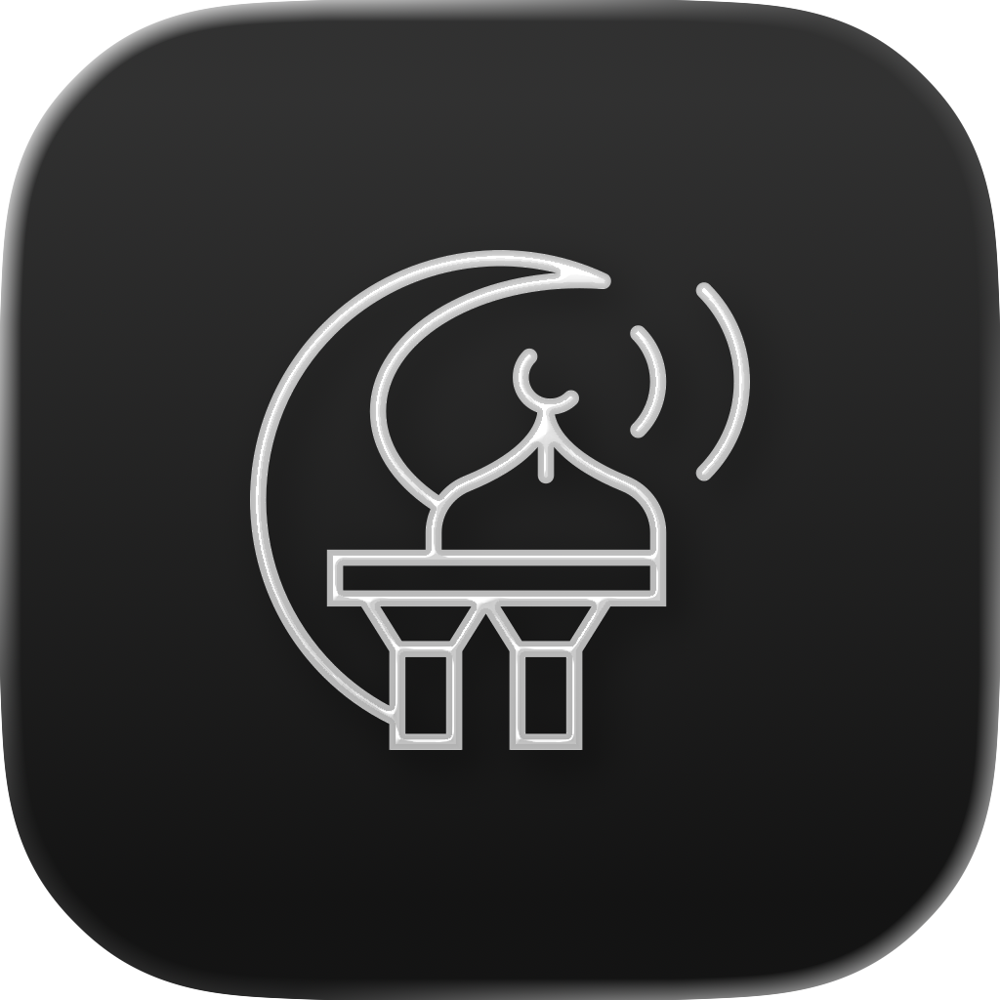

  

<h1 align="center">PrayerTime</h1>

  A native macOS menu bar app for accurate prayer times, Adhan notifications, and Hijri date.

  

---

## Features

- **Accurate Prayer Times** — Uses the [Aladhan API](https://aladhan.com/) with 23+ calculation methods (ISNA, Muslim World League, Umm Al-Qura, and more)
- **Adhan Notifications** — Choose between system notification, short Adhan, or full Adhan
- **Islamic (Hijri) Date** — View in English or Arabic alongside your prayer times
- **Menu Bar Display Options** — Icon Only, Icon + Countdown, or Prayer Name + Countdown
- **12/24-Hour Format** — Match your preferred time display
- **Auto Daily Refresh** — Prayer times update automatically after midnight
- **Launch at Login** — Start automatically with your Mac
- **Location-Based** — Detects your location for accurate times

## Privacy

PrayerTime uses your location solely to calculate prayer times via the Aladhan API. Your location data is never stored or shared.

## Built With

- SwiftUI
- [Aladhan API](https://aladhan.com/prayer-times-api#get-/timings/-date-)

## Website

The landing page is built with Next.js and lives in the `website/` directory.

## License

This project is source-available under a **Personal Use Only** license. See [LICENSE](LICENSE) for details.

You are free to use and modify this code for personal and educational purposes. **Publishing this app or any derivative on any app store or marketplace is strictly prohibited.**
